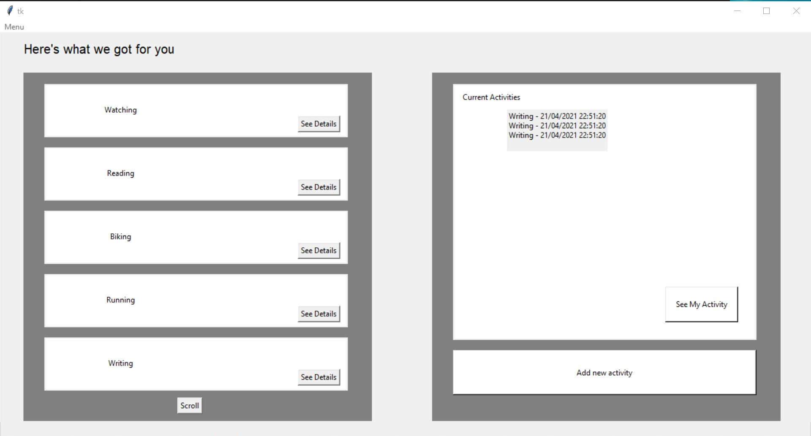
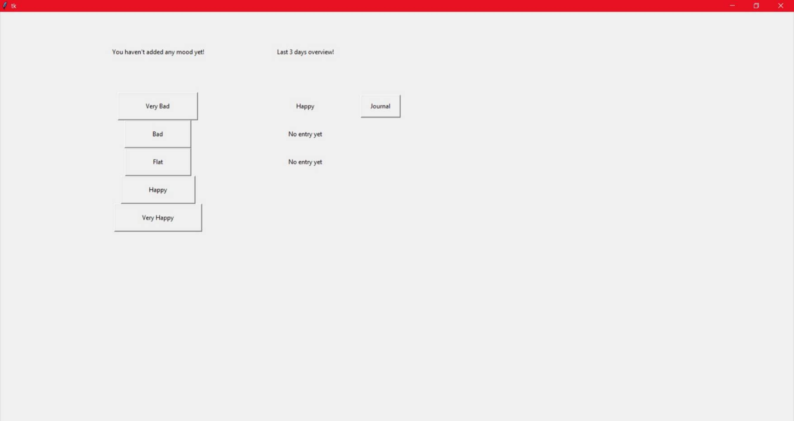
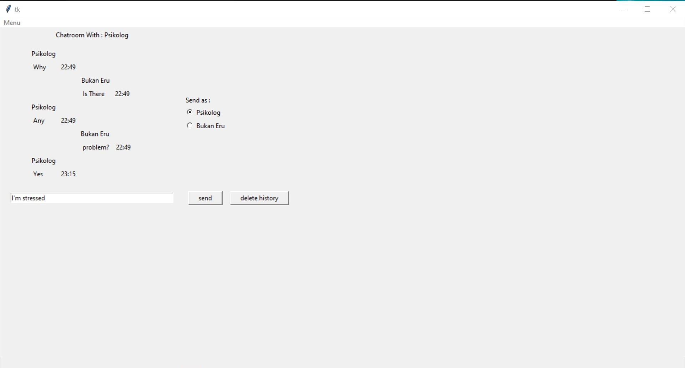
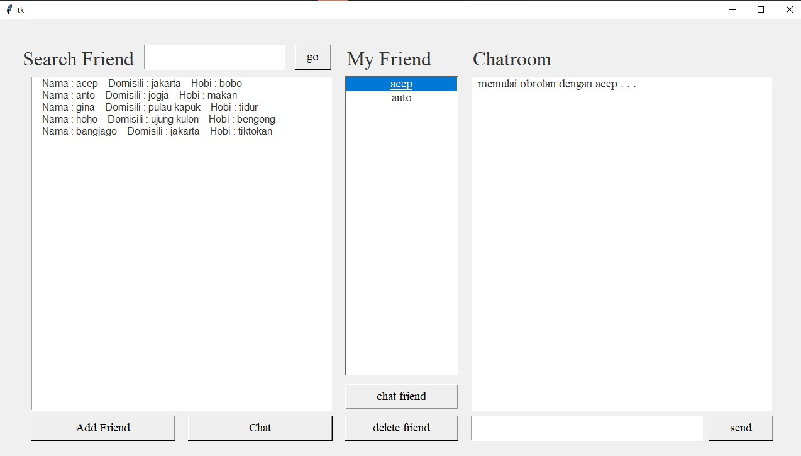

# IF2250-2021-K01-06-Coffee Break
## Deskripsi
Aplikasi Coffee Break. Sebuah aplikasi yang dikembangkan untuk membantu pengguna mencari teman dan psikolog serta mencatat keseharian pengguna berdasarkan mood dan aktivitas yang ia lakukan.

## Cara Menjalankan
1. Masuk ke directory src
2. Jalankan `python main.py` pada terminal

## Daftar Modul yang Diimplementasi
1. Modul Aktivitas (oleh 13519013 Rahmah Khoirussyifa' Nurdini)

2. Modul Mood (oleh 13519047 Rhea Elka Pandumpi)

3. Modul Psikolog (oleh 13519014 Mahameru Ds)

4. Modul Teman (oleh 13519011 Jesica)

## Daftar Tabel Basis Data yang Diimplementasi
1. activity = (activityId, activityName, activityDetail, timestamp)
2. jurnal = (moodId, date, mood_record, notes)
3. chatroom = (chatroomId, firstUserId, secondUserId)
4. message = (messageId, content, timestamp, chatroomId)
